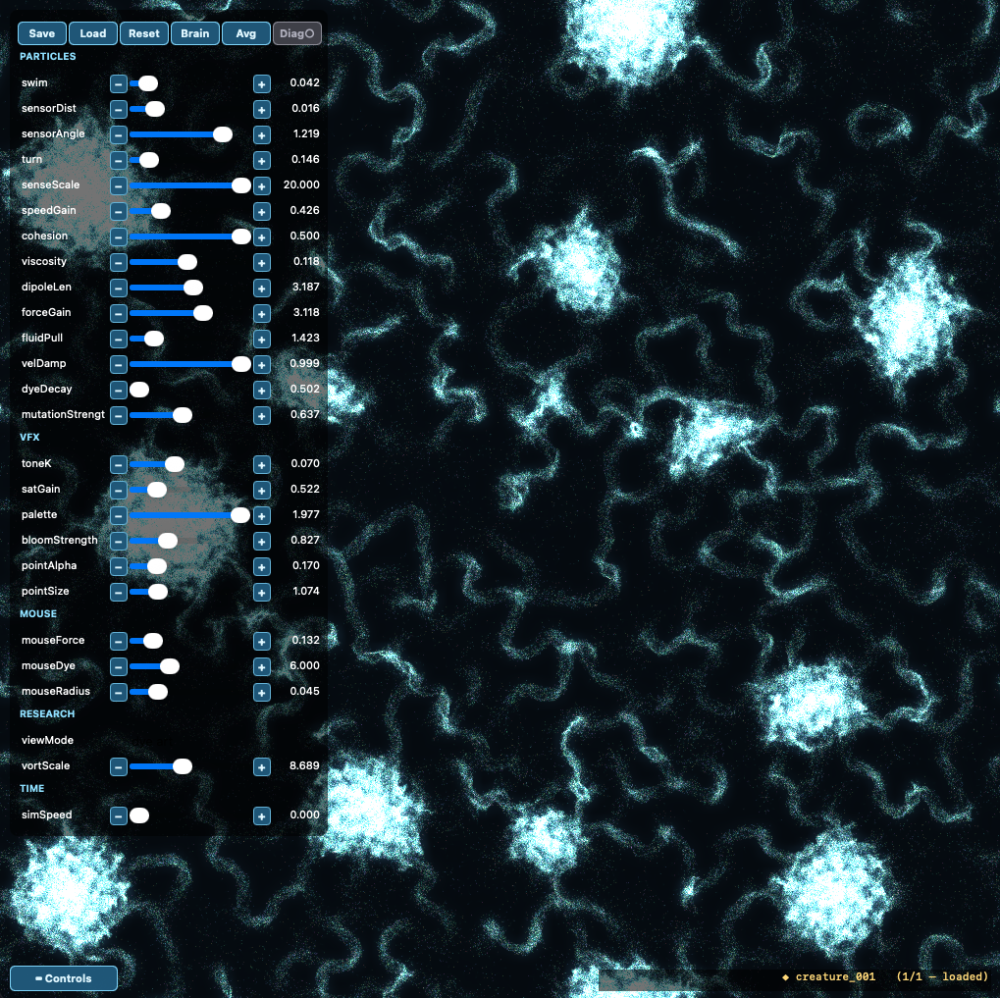
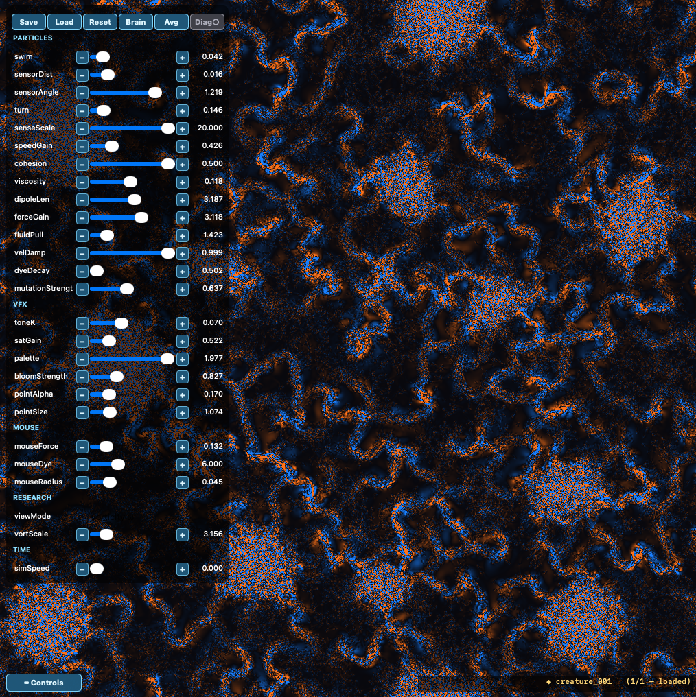

# fluoddity-metal

A Metal-native flow-field art engine and soft fluid-dynamics visualizer for
Apple Silicon — a fork of [Fluoddity](https://github.com/aphid91/Fluoddity) (by
aphid91), rebuilt from the ideas up in Swift + Metal rather than ported from its
OpenGL/GLSL-compute codebase. Both a **2D** engine and a **3D** engine.

<p align="center">
  
  
</p>
<p align="center"><em>The same captured creature, frozen mid-frame (<code>simSpeed</code> 0):
the dye art (left) and the fluid's vorticity ω underneath it (right) — flip between
them live with the <code>viewMode</code> dropdown.</em></p>

## Idea

Particles (agents) never interact directly; they sense and deposit into a shared
**velocity field**. Rather than letting that field merely decay and diffuse
(Physarum-style), we evolve it as a real incompressible flow —
**advect → project-to-divergence-free** (the Stable-Fluids loop). The agents are
the *forcing*; the projection is a discrete **Hodge/Helmholtz decomposition**
(a Jacobi pressure-Poisson solve). The result reads as genuine fluid motion —
vortices, advected filaments, shear — without claiming to solve Navier–Stokes
from boundary conditions: an incompressible-field solver driven by agent forcing.

Each agent steers through an **80-parameter symmetric Fourier "brain"**
(10 Fourier centers, evaluated twice mirror-averaged so there's no
clockwise/counter-clockwise bias), plus a **chemotaxis** term that lets them
aggregate into membranes and cells. You **breed** behaviors by re-rolling and
selecting (right-click, in both 2D and 3D), and the same engine doubles as a
**soft visualizer of the underlying fluid** (vorticity, enstrophy, divergence,
energy — including a fluid-only 3D vortex-tube view).

## Build & run

Requires macOS on Apple Silicon, the Swift toolchain (**Command Line Tools is
enough — no full Xcode**), and Metal. Shaders are compiled at runtime.

```sh
swift run fluoddity-metal               # 2D engine (the main app)
swift run fluoddity-metal --3d          # 3D engine (orbital, volumetric)

# headless verification (no window — runs the compute path + checks):
swift run fluoddity-metal --smoke       # toolchain / atomic_float
swift run fluoddity-metal --simtest     # 2D fluid incompressibility + stability
swift run fluoddity-metal --3dtest      # 3D fluid incompressibility + stability
swift run fluoddity-metal --capturetest # full-state capture round-trips bit-for-bit
swift run fluoddity-metal --spectest    # FFT energy-spectrum estimator check
swift run fluoddity-metal --vortprobe   # research views stay live (incl. paused)

# headless studies (write CSVs; see docs/spectrum_study.md):
swift run fluoddity-metal --sweep       # parameter survey        → sweep_results.csv
swift run fluoddity-metal --map         # drive×dissipation map   → map_results.csv
swift run fluoddity-metal --map3        # 3-param map (+sensors)  → map3_results.csv
swift run fluoddity-metal --sdscan      # sensorDist scan         → sdscan_*.csv
swift run fluoddity-metal --bistab      # bistability probe       → bistab_results.csv
swift run fluoddity-metal --3dspec      # 3D engine spectrum      → 3dspec_manifest.csv
```

## 2D engine

An agent-driven incompressible 2D fluid rendered as a colored dye field with the
agents overlaid. A live, grouped slider panel (top-left) tunes everything.

- **Mouse drag** — stir the fluid and inject dye.
- **Right-click** — adopt + mutate the cohort under the cursor (directed
  evolution; 8 cohorts, tinted by color).
- **`r`** — re-roll all brains (or use the **Brain** button).
- **`c` / `x`** — capture / restore a creature (full state, see below).
- **`j` / `k`** — record / replay a parameter path.
- **Save / Load / Reset** buttons — presets (params + brains) to `presets/*.json`.
- **Diag** toggle — research mode (HUD + plot + field calcs) vs art mode (perf).
- **`viewMode`** dropdown — dye art / **vorticity** ω / **enstrophy** |ω|² /
  **divergence** field. With the **E / Z / |ω|ₘₐₓ / div** HUD and a scrolling
  **E/Z time-series plot** (the research-viz layer; ties to the
  `navier-stokes` program — ω is exactly that 2D solver's state variable).
- Every slider has **−/+ steppers** for one-step fine-tuning.

## Faithful fluid

The fluid is not just Stable-Fluids-with-decay: the two unphysical shortcuts of
the original engine were replaced with their physical counterparts
(**[`docs/faithful_fluid.md`](docs/faithful_fluid.md)**):

- **Real viscosity** — uniform velocity damping was replaced by an explicit
  **ν∇² diffusion** pass (the `viscosity` knob). Damping kills all scales
  equally; viscosity is scale-selective (∝k²), which is what gives small
  scales a real dissipation range. A weak residual drag (`velDamp`) remains as
  the large-scale energy sink, as in forced-2D-turbulence practice.
- **Net-zero force dipoles** — agents no longer inject momentum as monopoles;
  each agent forces the fluid with a **+f/−f pusher dipole** (the `dipoleLen`
  knob), the defining property of active-swimmer forcing. Total injected
  momentum is zero to machine precision.

Incompressibility (Jacobi-Leray projection) and **chemotaxis** (`cohesion` —
agents steer toward higher dye = higher agent density, the ingredient that
makes them aggregate into membranes and cells) were already faithful and kept.

## Capture: creatures & paths

The system is **hysteretic** — a grown structure depends on the *path* of
parameter changes that produced it, not just the final values — so good
creatures can't be reproduced from a preset alone. The capture system
(**[`docs/capture.md`](docs/capture.md)**) saves the **full state** instead:

- **`c`** — capture the current creature (velocity + dye fields, every agent,
  brains, params) to `captures/creatures/*.fluo`. Round-trips bit-for-bit
  (verified by `--capturetest`).
- **`x`** — restore, cycling through saved captures (amber status label,
  bottom-right).
- **`j`** — toggle recording the parameter *path* (a timed journal of every
  knob) to `captures/paths/`; **`k`** — replay the last path from the current
  state.

Works identically in 3D (`captures/creatures3d`, `.fluo3`).

## 3D engine (`--3d`)

The whole model promoted to 3D, the owner's `3dMC` idea realized: a 160³
incompressible fluid (6-neighbour Hodge projection) forced by agents whose
**Monte-Carlo tangent-plane brain** samples random planes containing their
velocity, runs the 2D symmetric brain per plane, and integrates the steering into
3D. The faithful-fluid retrofit applies here too (ν∇² viscosity, net-zero
dipole forcing), and chemotaxis senses the full **3D dye gradient** — crank
the `cohesion` knob to grow volumetric creatures. Rendered as a
**ray-marched volume** of the agents' dye density.

- **Drag** to orbit · **scroll** to zoom.
- **Right-click** — adopt + mutate the cohort under the click ray (directed
  evolution, same as 2D; 8 cohorts — raise `pointAlpha` to tint agents by
  cohort and see who's who).
- **`r`** — re-roll all 8 cohort brains.
- **`[` / `]`** — dim / brighten the volume density.
- **`c` / `x`** and **`j` / `k`** — capture/restore creatures and
  record/replay paths, same as 2D.

## Spectrum study

The research-viz layer measures the time-averaged energy spectrum E(k). A headless
parameter survey (`--sweep`) and a 2D drive×dissipation map (`--map`) show the
engine produces clean power-law spectra whose **exponent is not universal** — it
slides from ~−0.5 to ~−3.2 with forcing and dissipation, and within the dominant
plane obeys a two-group law (slope ≈ 1.24·log₁₀(forceGain) + 0.47·log₁₀(drag) −
1.12, R² = 0.955). So −5/3 is a *dial position*, not a cascade law: this is a
forced-dissipative active flow, not 2D turbulence. Full write-up + figures:
**[`docs/spectrum_study.md`](docs/spectrum_study.md)**.

## How it's built

Pure SwiftPM (no Xcode project), AppKit + Metal, runtime-compiled `.metal`
sources held as Swift strings. No external dependencies. Every step is verified
headlessly (the compute path + incompressibility checks) since the rendered
window can only be eyeballed; see the `--*test` flags above.

## License

[AGPL-3.0](LICENSE).

---

Fork of [aphid91/Fluoddity](https://github.com/aphid91/Fluoddity) (MIT) — built
from the ideas, idea-sharing collaboration. Made with
[Claude Code](https://claude.com/claude-code).
