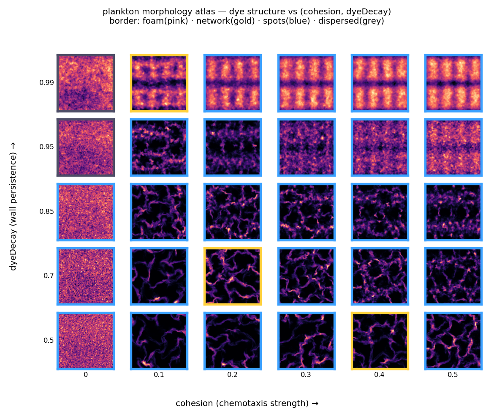

# Morphology atlas

*Why is foam so easy to find?* This maps the engine's dye-structure regimes across
the two morphology-determining knobs — **cohesion** (chemotaxis / aggregation
strength) and **dyeDecay** (how long deposited dye persists) — to answer that.



Run it yourself:

```sh
swift run plankton --morphtest    # verify the descriptors on synthetic patterns
swift run plankton --morphology   # sweep → data/morphology.csv + data/morphology_thumbs.bin
.venv/bin/python study/morphology_atlas.py   # → figures/fig_morphology.png
```

## Descriptors

Each cell's dye field is classified from three measures (verified by `--morphtest`):

- **contrast** — coefficient of variation (std/mean). Below ~0.15 there's no real
  structure → **dispersed**.
- **Euler characteristic χ** of the bright (above-threshold) set, by 2×2 bit-quad
  counting (a Minkowski functional). χ < 0 ⇒ a connected network enclosing dark
  cells (closed **foam**); χ > 0 ⇒ disconnected bright islands.
- **largest-component fraction (LCC)** — the fraction of the bright set in its
  single biggest 8-connected component. High ⇒ one connected **network**; low ⇒
  many discrete **spots**. (Euler sign alone can't separate an *open* foam from
  discrete blobs — both are χ > 0 — so connectivity is the deciding measure.)

Classes: **dispersed** (no contrast) · **spots** (discrete aggregates) ·
**network** (connected, open) · **foam** (connected, closed cells).

## What the map shows

The sweep is run around the cohesion-cranked **preset_005** baseline (the
spectrum-study `preset_003` produces *no* structure — a washed-out, saturated
dye — which is why a naïve sweep over it finds nothing). At 1 agent/cell:

1. **Chemotaxis makes structure robust.** For any cohesion > 0, the dye organises
   into aggregates across essentially the whole `dyeDecay` range. This is why
   "creatures" are easy to find — the chemotactic aggregation instability is a
   large, forgiving basin.
2. **The cohesion = 0 + high-dyeDecay corner washes out to dispersed.** With no
   aggregation *and* persistent dye, deposition saturates uniformly → no contrast.
   High `dyeDecay` is a *saturation* knob: it raises the dye floor and *reduces*
   contrast, the opposite of the naïve intuition.
3. **Connected foam is a narrow band, not the default.** The gold *network* cells
   sit at low–moderate cohesion + low `dyeDecay`; most of the high-cohesion plane
   is discrete **spots** (the radial "creature" blobs). So what's broadly easy is
   *aggregate structure*; a true closed-cell **foam** is a specific corner — it
   needs walls that persist and connect rather than collapsing into separate blobs.

**Caveat.** The brain is held fixed (preset_005), so this is the *chemotaxis*
morphology plane for one genome. The low-cohesion regime — where the Fourier
brain re-asserts and structure becomes genome-dependent — is not captured by a
single fixed brain; that's a separate axis worth its own sweep.
