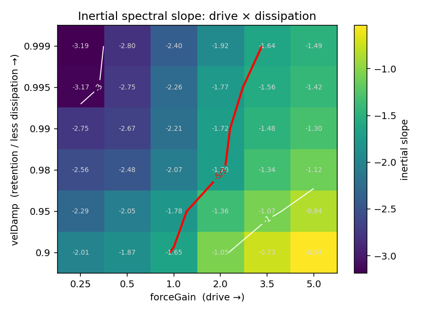
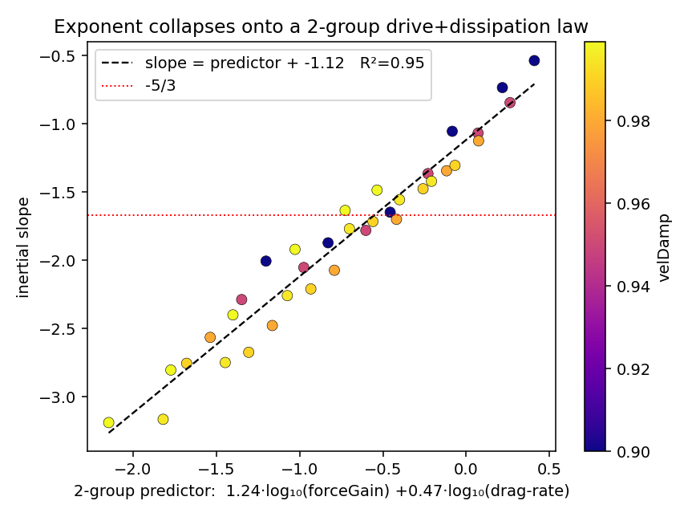
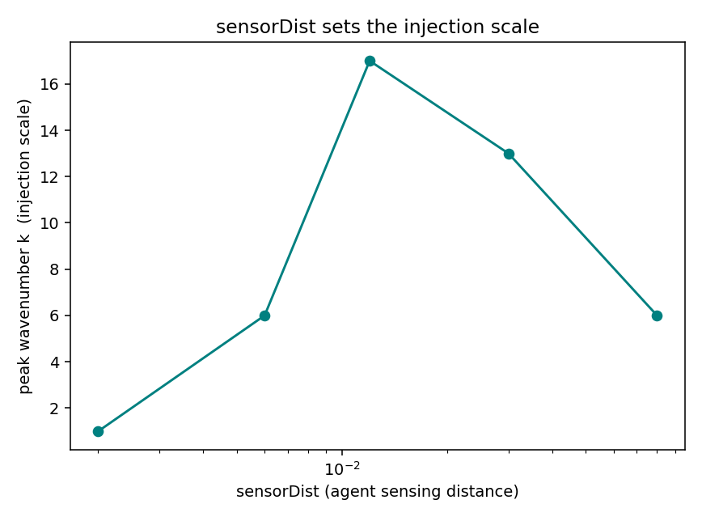
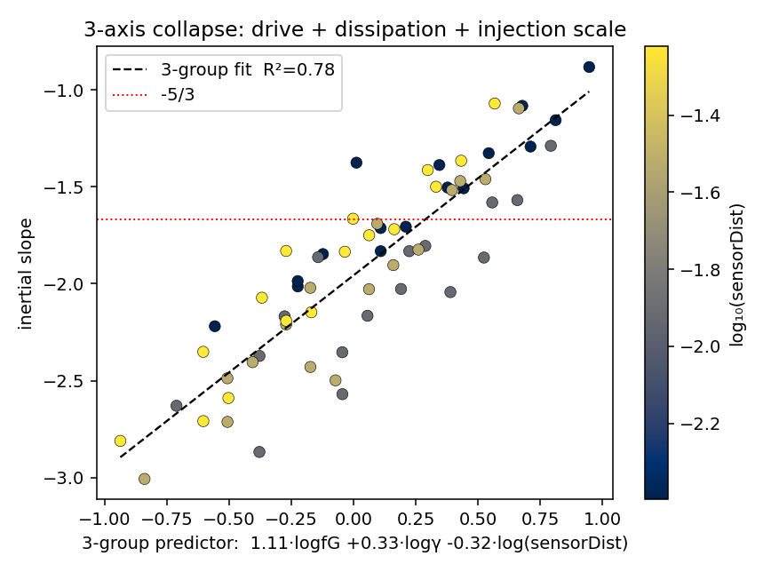
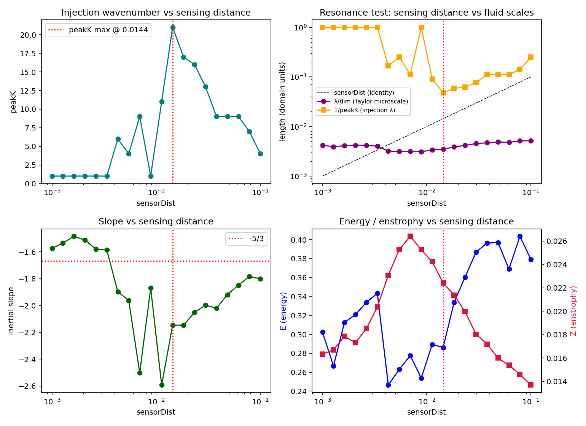
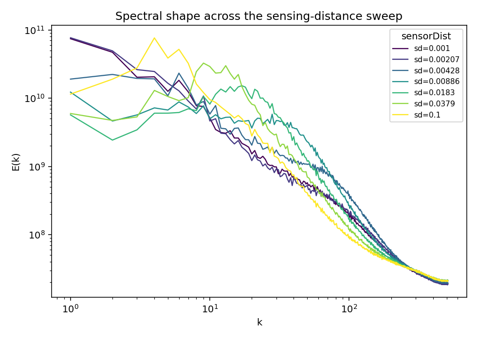
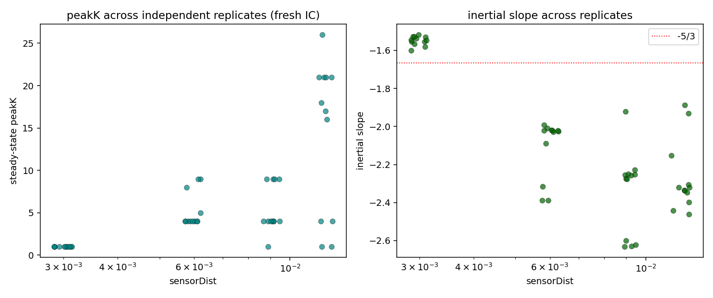
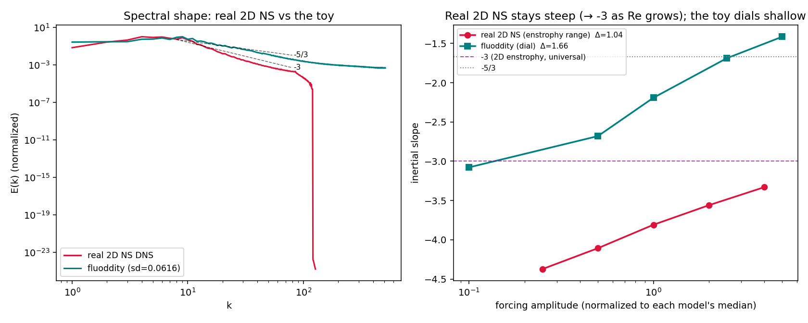
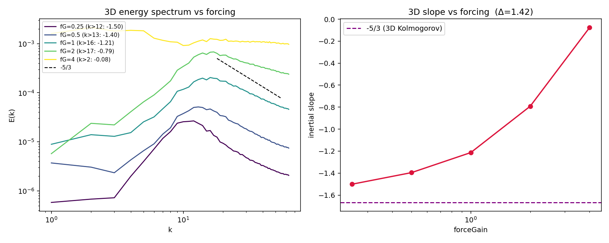

# Spectral exponent in an agent-forced 2D incompressible flow

*A tunable, non-universal energy spectrum — and the two-group law that organizes it.*

## Summary

plankton forces a real incompressible 2D fluid (Stable-Fluids: advect →
Hodge/Leray project) with ~10⁶ agents driven by a symmetric Fourier brain. We
measured the time-averaged radial energy spectrum E(k) over the parameter space
and asked whether it shows a Kolmogorov-style inertial cascade.

**It does not — and that's the result.** The spectrum is a *clean power law*
almost everywhere (fit R² 0.92–0.99), but its **exponent is not universal**: it
slides continuously from **≈ −0.5 to ≈ −3.2** as the forcing and dissipation are
tuned. −5/3 is not a law the system obeys; it is one **dial position**.

Within the two dominant levers — drive (`forceGain`) and dissipation (`velDamp`)
— the exponent obeys a clean **two-group log-linear law**:

> **inertial slope ≈ 1.24·log₁₀(forceGain) + 0.47·log₁₀(γ) − 1.12,  R² = 0.955**

where γ = −ln(velDamp) is the per-frame drag rate. Both groups carry the *same*
sign: more drive **and** more dissipation each *shallow* the slope (drive with
~2.6× the leverage). The naive `drive/dissipation` ratio does **not** collapse it
(R² = 0.01) — the two inputs do not oppose, so −5/3 traces a **diagonal contour**
across the drive–dissipation plane (Fig. 1, red line).

This is the spectral signature of a **forced-dissipative active flow**, not a
turbulent cascade. The engine is an excellent *visualization and intuition* tool
and a tunable spectral toy — but a cascade exponent cannot be quoted from it,
because the exponent is set by the forcing configuration.

## 1. Instrument

The numbers are only as trustworthy as the estimator, and the first readings
were **artifacts** — a cautionary chain worth recording:

1. **Anti-aliasing.** The spectrum FFT first strided-downsampled the 1024² field
   to 256², which *aliases* high-k energy into the band and **flattens the
   high-k slope** — manufacturing shallow "−5/3-ish" slopes across almost any
   setting. Fixed by running the FFT at full resolution (`Spectrum(n: 1024)`,
   block-averaged if reduced). See `Spectrum.swift`.
2. **Time-averaging.** A single-frame spectrum fluctuates; its slope/R² bounce.
   `Spectrum` now accumulates a running mean (reset on any flow change). Slopes
   are fit over N ≈ 70–100 accumulated frames.
3. **Trimmed inertial fit.** The full right-limb fit blends the energy-containing
   shoulder and the dissipation tail. `SpectrumFit` reports both the full fit and
   a **trimmed inertial fit** over `[3·peak, k_max/2]`. *All slopes quoted here
   are the trimmed inertial slope.* Same code drives the live plot and the
   headless harness (single source of truth).

A control check: a synthetic wave `vx = cos(2π·8·x/n)` peaks at exactly k=8
(`--spectest`).

**Caveat on `velDamp`:** it is a *uniform, scale-independent* drag (`vel *=
velDamp`), not viscosity — it sets the overall energy level, not a small-scale
dissipation scale (which is fixed by the diffusive semi-Lagrangian advection +
grid). So γ is a drag rate, and the "dissipation" axis is an energy-sink axis.

## 2. Results

### 2.1 No universal exponent (one-axis-at-a-time survey)

Holding everything at a baseline (`preset_003`) and walking one knob at a time
(`--sweep`, 44 settings). Every dynamical knob moves the inertial slope; ranked
by effect size:

| knob | inertial slope range | Δ | note |
|---|---|---|---|
| **forceGain** | −3.08 → −1.42 | **1.66** | strongest lever |
| **velDamp** | −1.15 → −2.06 | 0.91 | (energy-sink axis) |
| **sensorDist** | −1.53 → −2.41 | 0.88 | **also sets peakK 1→17** |
| **senseScale** | −1.60 → −2.26 | 0.66 | |
| **swim** | −1.72 → −1.16 | 0.56 | swim=0 → dead flow |
| speedGain / fluidPull / cohesion | ~0.33 each | weak | |
| **brain** | −1.78 → −2.04 | **0.26** | **weakest → brain-independent** |

The exponent spans the classical 2D values and beyond: **weak drive → ≈ −3**
(enstrophy-cascade-like), **strong drive → shallow** (toward −0.5), passing
through −5/3. The forcing *structure* (brain) is the least influential input —
the spectrum is governed by forcing *amplitudes and scales*, not the pattern.

### 2.2 The drive × dissipation map and the two-group law

A 36-cell `forceGain × velDamp` grid (`--map`), everything else at baseline,
gives a smooth monotonic surface (Fig. 1). The −5/3 contour is **diagonal**: the
two levers trade off. Fitting the 36 cells:

- naive ratio `slope ~ log₁₀(drive/γ)`: **R² = 0.01** (fails — they don't oppose)
- two groups `slope ~ log₁₀(forceGain) + log₁₀(γ)`: **R² = 0.955** (Fig. 2)

So in this plane the exponent is a clean, ~95%-predictable two-group law. The
velDamp colors are fully mixed along the collapse line (Fig. 2) — confirming it
is the *combination*, not either lever alone.




### 2.3 Injection scale

`sensorDist` (how far agents sense) sets the **injection wavenumber** (the
spectral peak), non-monotonically, maxing near sensorDist ≈ 0.012 → peak k ≈ 17
(Fig. 3). This is the scale at which the agents pump energy into the fluid.



### 2.4 Collapse: clean in-plane, partial globally

The collapse test (`analyze_collapse.py [map|sweep]`) ranks candidate control
variables by how tightly the slope collapses onto each. The answer depends
critically on the *sampling*:

- **On the dense map** (36 joint forceGain×velDamp cells) the slope collapses
  onto a **single derived variable `forceGain·γ^0.38`** at **R² = 0.955** (= the
  two-group fit reparametrized; Fig. 2). The intrinsic `sqrt(Z/E)` also collapses
  it (R² = 0.92, though partly circular — Z is built from the same spectrum). So
  *within the drive–dissipation plane the exponent is a genuine low-dimensional
  law.*
- **On the sparse OAT set** the same variable reaches only R² = 0.64 (best
  four-input law R² = 0.69) — the one-axis excursions confound and *understate*
  the collapse. The dense joint grid is the proper substrate; the OAT's apparent
  "no collapse" was a sampling artifact.

Honest synthesis: the exponent ≈ a clean **two-group drive+dissipation law in its
dominant plane** (R² 0.955), with **secondary modulation** from the scale/coupling
knobs (`sensorDist` injection scale, `senseScale`) that the map holds fixed —
these add real structure the OAT exposes but the two-group law omits. (On the map
a 3-group model adds nothing: `senseScale` is constant there, correctly detected
as a dead predictor.)

### 2.5 Three axes: the injection scale breaks the law

Adding `sensorDist` as a third axis (`--map3`, 4×4×4 = 64 cells) tests whether the
two-group law *extends* to a clean three-group law. **It does not** (Fig. 4):

- In the pure drive×dissipation plane (fixed sensorDist) the two-group fit was
  **R² = 0.955**. Once `sensorDist` varies, the *same* two-group fit drops to
  **R² ≈ 0.74** — the injection scale injects variance drive+dissipation can't see.
- Adding `sensorDist` as a third *log-linear* group recovers only part of it
  (**R² ≈ 0.78–0.80**, coefficient −0.32) — nowhere near 0.955. So `sensorDist`'s
  effect is **not log-linear**: a monotonic group cannot capture the non-monotonic
  peak-k response (§2.3, the hump at sensorDist ≈ 0.012).
- At strong dissipation + small injection scale, 6 of 64 cells fall below the
  power-law cleanliness bar (R² < 0.88) — the spectrum stops being a clean power
  law off the baseline plane.

**The two-group law is plane-local, not global.** The injection scale is a genuine
third dimension with non-log-linear structure; the exponent is *not* a
low-dimensional law across the full forcing space. Drive×dissipation collapses
cleanly (R² 0.955); the injection scale breaks it.



### 2.6 Characterizing the injection scale: a threshold at the Taylor microscale

A fine log-spaced sweep of `sensorDist` alone (`--sdscan`, 20 points, others at
baseline; Figs. 5–6) resolves the peak-k hump and explains why §2.5's log-linear
fit failed. The injection wavenumber is a **threshold-and-decline** function of the
sensing distance, not a power law:

- **Below sensorDist ≈ 0.004** (sensing distance < the Taylor microscale
  λ = √(E/Z) ≈ 4 cells): the spectral peak sits at **k = 1** — agents sense within
  a single eddy and drive the *bulk* (largest) scale (6 points, all peakK = 1;
  Fig. 6 purple).
- **Onset at sensorDist ≈ λ:** structured injection switches on right where
  `sensorDist` crosses λ (the crossing is at ≈ 0.0037, coinciding with peakK's
  departure from 1). Once the sensing distance exceeds the flow's gradient scale,
  agents "feel" velocity gradients and inject sub-structure.
- **Peak injection at sensorDist ≈ 0.014** (≈ 3–4 λ): **peakK ≈ 21**, the
  smallest-scale injection, energy built into a mid-k bump (Fig. 6 green).
- **Above the optimum:** peakK declines smoothly (21 → 4 by sensorDist = 0.1) — a
  larger sensing distance averages over bigger regions and coarsens the injection
  back toward large scales (Fig. 6 yellow).
- The transition zone (0.004–0.012) is **noisy/bistable** — peakK scatters
  (6, 4, 9, 1, 11, 21), one point dropping to R² = 0.89.

Two robust corollaries: (1) all spectra **converge to the same dissipation tail**
at k ≳ 200 (Fig. 6) — the small-scale cutoff is set by the solver (numerical
diffusion + grid), *not* by `sensorDist`, consistent with §2.1/§2.5; (2) the
steepest slopes (≈ −2.5) occur in the structured-injection regime, where the high
injection-k leaves the longest range for the spectrum to fall over.

**This is why `sensorDist` broke the low-dimensional law (§2.5):** the injection
scale is a *threshold* relative to a measured fluid length (the Taylor microscale),
then a decline — not a smooth log-linear knob. No monotonic group can fit a
threshold-and-decline.




### 2.7 The transition zone is genuinely multistable

The "noisy" transition zone flagged in §2.6 is **not noise — it is multistability**.
Probing it (`--bistab`): at each sensorDist, 12 independent replicates (a fresh
random initial condition each, *identical* baseline brain), measuring the
steady-state peakK (Fig. 7):

| sensorDist | peakK across 12 replicates | reading |
|---|---|---|
| 0.003 (sub-threshold) | `1` ×12 (std 0.0) | **monostable** — control |
| 0.006 | mostly `k=4`, a few escape to `k≈9` (std 2.0) | bistability emerging |
| 0.009 | `k≈4` (8×) **and** `k≈9` (4×) (std 2.7) | **bistable** |
| 0.012 | `k≈1–4`, `k≈16–21`, one `k=26` (std 8.7) | **multistable** |

The control (0.003) collapsing to a *single* value (std = 0) is the decisive
check: the generous warmup does reach a unique attractor where one exists, so the
spread at larger sensorDist is real attractor multiplicity, not under-convergence.
The slope co-splits (Fig. 7, right): the low-k attractor at slope ≈ −2.0, the
high-k attractor at ≈ −2.4.

**Mechanism — the threshold is a region of coexistence, not a switch.** §2.6
placed the bulk-drive → structured-injection transition at sensorDist ≈ the Taylor
microscale λ. Near that threshold *both* attractors are dynamically accessible —
the sub-λ "drive-the-bulk" state (low k) and the super-λ "inject-structure" state
(high k) — and the initial condition selects which the flow falls into.
Multistability *strengthens* across the zone (std 0 → 2.0 → 2.7 → 8.7) as the
high-k attractor opens up. This is exactly why the single-replicate sensorDist
sweep (§2.6) looked noisy there: it was sampling a multistable region one draw at
a time.



### 2.8 Calibration against a real 2D NS DNS

To ground the toy against ground truth, I built a forced 2D Navier–Stokes
pseudospectral DNS (`ns2d_dns.py`: vorticity form, integrating-factor RK4, 2/3
dealiasing, steady random forcing at k_f = 10 + large-scale drag). Correctness
anchor (`selfcheck`): unforced inviscid Euler conserves energy and enstrophy to
machine precision — the same solver-validation logic as the navier-stokes repo's
`spectral_2d_control.jl`.

**What a real 2D enstrophy cascade looks like** (Fig. 8): a steep falloff above
the forcing scale — fitted slope **−3.3 to −4.4** over the inertial window
(R² 0.99), with a sharp viscous cutoff. Sweeping forcing amplitude (0.5 → 8) the
slope drifts −4.37 → −3.33 but **converges toward the universal Kraichnan −3** as
Re grows (more forcing → wider inertial range): the drift is a finite-Re *fitting*
effect, and the slope stays **pinned in the steep enstrophy band, never shallower
than −3.3.**

**The contrast with the toy** (Fig. 8, right): the original-engine slope dials from
−3.1 down to **−1.4** — reaching far shallower than *any* real 2D NS enstrophy
cascade. Both drift with forcing (both change Re), but the DNS sits in the
enstrophy band converging to −3, while the engine accesses a **shallow-spectrum
regime 2D NS physically cannot** (the preset_003 baseline, ≈ −1.4 to −1.85, lies
well above anything the DNS reaches). The spectral *shapes* differ in kind
(Fig. 8, left): the DNS is steep with a clean viscous cutoff; the engine is
shallow and extends shallowly to the grid scale.

**Calibration verdict.** This confirms §3 quantitatively: the engine's spectra
are *not* 2D NS cascades. A real cascade has a steep, Re-converging, universal
exponent pinned near −3; the toy has a shallow, freely-tunable exponent with no
universal limit. (Caveat: the DNS is N=256 with a limited inertial range; higher
resolution would tighten the convergence to −3 but not change the conclusion.)



### 2.9 The dial is dimension-independent: the 3D engine too

The decisive test for "real cascade vs dial": in *3D*, turbulence's forward
**energy** cascade genuinely is −5/3 (Kolmogorov) — unlike 2D. So if the engine's
spectrum were set by fluid dynamics, it should *lock onto* −5/3 in 3D. It does not.

A 3D spectrum probe (`--3dspec`: the 128³ incompressible engine, forcing swept
over a fixed brain; velocity dumped and 3D-FFT'd, spherically binned in numpy via
`analyze_3dspec.py`) gives, on the forward limb *above* the injection peak
(Fig. 9):

| forceGain | peakK | forward slope | R² |
|---|---|---|---|
| 0.25 | 12 | −1.50 | 0.98 |
| 0.5 | 13 | −1.40 | 1.00 |
| 1 | 16 | −1.21 | 1.00 |
| 2 | 17 | −0.79 | 0.99 |
| 4 | 2 | −0.08 | 0.25 (large-scale-flooded) |

These are *clean* power laws (R² 0.98–1.00), but the slope is **forcing-controlled
— a dial, exactly as in 2D**, shallowing −1.50 → −0.79 as forcing grows. And
**every slope is shallower than the 3D Kolmogorov −5/3**: the engine does not
produce a real forward energy cascade even where one is expected. At the highest
forcing the spectrum floods the large scales (peak → k=2, nearly flat).

**Capstone.** The agent forcing dominates the fluid dynamics *regardless of
dimension*. The engine is a forcing-controlled spectral dial in **both 2D and
3D** — a forced-dissipative active system, not turbulence, in either. (Caveat:
128³ is modest — the agents force at k≈12–17, leaving only ~k 17–55 of forward
range, so the *absence* of −5/3 is partly forcing-scale/resolution-limited; but
the forcing-*control* of the slope is the robust dial signature, independent of
range.)



## 3. What this is and isn't

- **It is:** a forced-dissipative active flow whose energy spectrum is a clean
  power law with a **forcing-controlled, non-universal exponent**, well-described
  in the dominant plane by a two-group drive+dissipation law (R² 0.955) — but a
  **plane-local** one: varying the injection scale breaks it (§2.5).
- **It is not:** 2D Navier–Stokes turbulence with a Kolmogorov/Kraichnan
  inertial range. There is no damping-independent cascade exponent — the slope
  tracks the inputs, which is the defining negative test for an inertial range.
  Directly calibrated against a real forced 2D NS DNS (§2.8): the engine's
  spectra are *shallower than and distinct from* a real enstrophy cascade
  (pinned ≤ −3, converging to the universal −3), reaching into a regime 2D NS
  cannot.
- **It also shows genuine multistability** near the injection-scale threshold
  (§2.7): coexisting low-k and high-k flow attractors selected by the initial
  condition — a real dynamical feature, not a numerical artifact.
- **The dial is dimension-independent** (§2.9): the 128³ 3D engine's
  forward-cascade slope is also forcing-controlled and stays *shallower than* the
  3D Kolmogorov −5/3 — so even where a real forward energy cascade is expected,
  the agent forcing dominates. A spectral dial in 2D and 3D alike.
- **For the navier-stokes program:** use this engine for visualization and
  intuition, *not* to quote a cascade exponent. The reportable physics is the
  **dial map itself** (Fig. 1), the two-group law, the threshold/multistability
  of the injection scale, and the 2D-DNS calibration.

## 4. Reproduce

```
swift run plankton --spectest      # FFT estimator control check (peak at k=8)
swift run plankton --sweep         # OAT survey      → sweep_results.csv
swift run plankton --map           # 2D drive×damp   → map_results.csv
swift run plankton --map3          # 3-axis +sensorDist → map3_results.csv
swift run plankton --sdscan        # fine sensorDist sweep → sdscan_{summary,spectra}.csv
swift run plankton --bistab        # multistability probe → bistab_results.csv
.venv/bin/python analyze_collapse.py map  # collapse test (dense) → collapse_table_map.csv
.venv/bin/python analyze_collapse.py map3 # 3-group test    → collapse_table_map3.csv
.venv/bin/python make_figures.py          # figures 1-4 + the 2- & 3-group fits
.venv/bin/python characterize_sd.py       # figures 5-6 + the resonance/threshold test
.venv/bin/python bistab_analyze.py        # figure 7 + the multistability modality test
.venv/bin/python ns2d_dns.py selfcheck    # real 2D NS DNS: Euler invariant conservation
.venv/bin/python ns2d_dns.py sweep        # DNS forcing-amplitude sweep → ns2d_sweep.csv
.venv/bin/python ns2d_dns.py run          # one DNS run → ns2d_spectrum.csv
.venv/bin/python ns_compare.py            # figure 8: DNS vs the engine
swift run plankton --3dspec        # 128³ 3D forcing sweep → vel3d_*.bin + manifest
.venv/bin/python analyze_3dspec.py        # figure 9: 3D energy spectrum (numpy 3D FFT)
```

Artifacts: `{sweep,map,map3}_results.csv`, `sdscan_{summary,spectra}.csv`,
`bistab_results.csv`, `ns2d_{spectrum,sweep}.csv`, `3dspec_manifest.csv`,
`collapse_table_{map,map3,sweep}.csv`, `figures/fig1..fig9 *.png` (3D dumps
`vel3d_*.bin` are gitignored — regenerate with `--3dspec`). Real-NS reference
solver: `ns2d_dns.py`. Baseline
config: `presets/preset_003.json`. Slope code: `SpectrumFit.swift` (shared by
the live `SpectrumView` and the headless harnesses).
